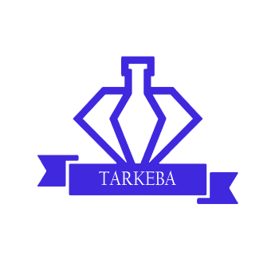

<p align="center">
  
</p>
<p align="center">Tarkeba is an e-commerce app for selling perfumes 🛍️🌸</p>

## Description

Tarkeba is an e-commerce application designed for selling perfumes. Built with the [NestJS](https://github.com/nestjs/nest) framework, it leverages TypeScript for a robust and scalable architecture. The application includes features such as user authentication, product management, order processing, and email notifications. It integrates with Google OAuth for user authentication and uses Redis for caching and session management. The backend is powered by MongoDB, ensuring efficient data storage and retrieval.

Key Features:
- User registration and login with email verification
- Google OAuth integration for authentication
- Password reset functionality
- Role-based access control
- Product management (CRUD operations)
- Order processing and management
- Email notifications for account verification and password reset
- Redis integration for caching and session management
- JWT-based authentication and refresh tokens
- Comprehensive unit and e2e testing

This project is a comprehensive solution for building a modern e-commerce platform with a focus on security, scalability, and maintainability.

## Project setup

1. Clone the repository

2. Install the dependencies:

```bash
$ npm install
```

3. Set up environment variables

4. Start the Redis server:

Before running the project, make sure to start the Redis server:

```bash
$ sudo service redis-server start
$ redis-cli
```


## Compile and run the project

```bash
# development
$ npm run start

# watch mode
$ npm run start:dev

# production mode
$ npm run start:prod
```

## Run tests

```bash
# unit tests
$ npm run test

# e2e tests
$ npm run test:e2e

# test coverage
$ npm run test:cov
```

## Deployment

When you're ready to deploy your NestJS application to production, there are some key steps you can take to ensure it runs as efficiently as possible. Check out the [deployment documentation](https://docs.nestjs.com/deployment) for more information.

If you are looking for a cloud-based platform to deploy your NestJS application, check out [Mau](https://mau.nestjs.com), our official platform for deploying NestJS applications on AWS. Mau makes deployment straightforward and fast, requiring just a few simple steps:

```bash
$ npm install -g mau
$ mau deploy
```

With Mau, you can deploy your application in just a few clicks, allowing you to focus on building features rather than managing infrastructure.
